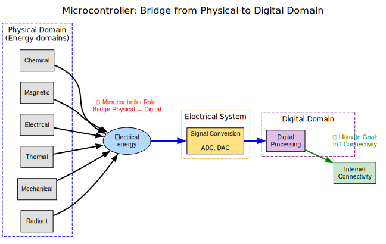
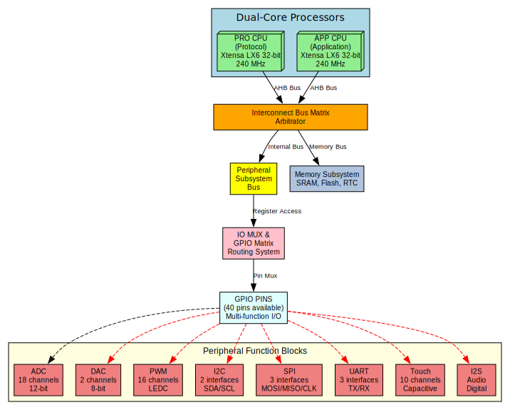
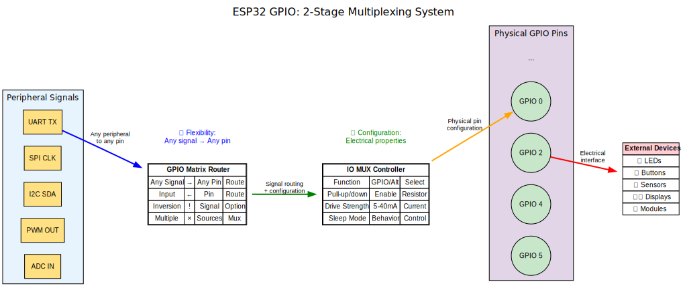
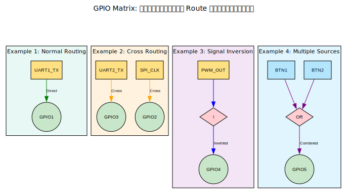
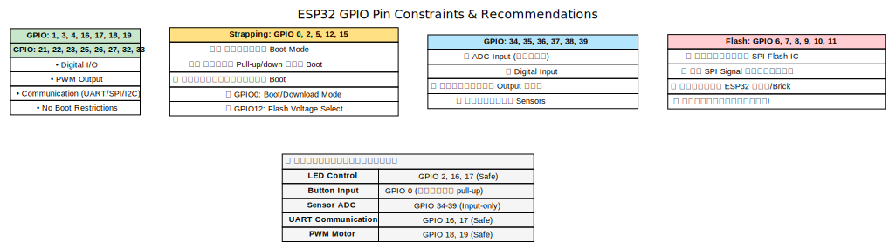
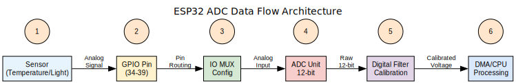
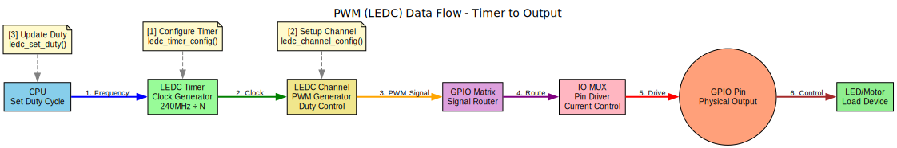
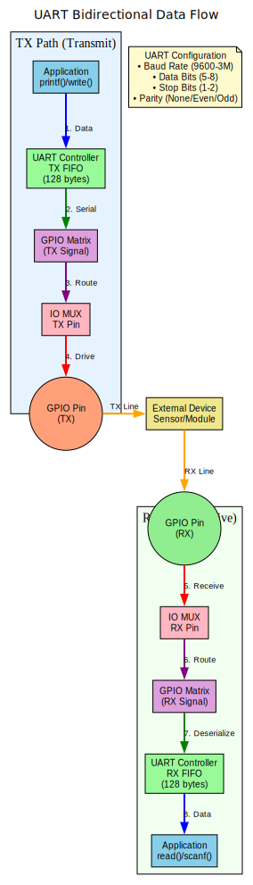
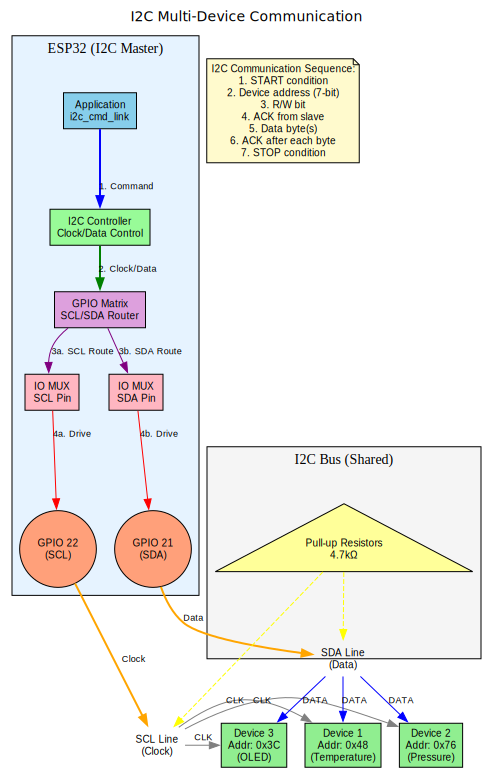

# 📚 ใบความรู้: ESP32 GPIO Architecture

## 🎯 วัตถุประสงค์การเรียนรู้
หลังจากศึกษาเนื้อหานี้แล้ว ผู้เรียนจะสามารถ:
1. อธิบายสถาปัตยกรรมของ ESP32 โดยเฉพาะระบบ GPIO
2. เข้าใจการทำงานของ Dual-Core Processing
3. อธิบายการทำงานของ Bus Matrix และ Peripheral Subsystem
4. เข้าใจการ Multiplexing ของ GPIO pins

---

## 🌉 Microcontroller: สะพานเชื่อมโลกกายภาพสู่ดิจิทัล



### 🎯 วัตถุประสงค์หลักของ Microcontroller

ในการใช้งาน **Microcontroller** วัตถุประสงค์สำคัญที่สุดคือการ **เชื่อมโลกแห่งกายภาพ (Physical World)** เข้ากับ **โลกดิจิทัล (Digital Domain)** เพื่อสามารถ:

#### 🌍 **Physical Domain → Digital Domain**
1. **🔥 Energy Domains** - รับสัญญาณจากพลังงานรูปแบบต่าง ๆ
   - **Radiant** (แสง) → Photosensor, Camera
   - **Mechanical** (การเคลื่อนไหว) → Accelerometer, Gyroscope
   - **Thermal** (ความร้อน) → Temperature sensor
   - **Electrical** (ไฟฟ้า) → Voltage/Current sensor
   - **Magnetic** (แม่เหล็ก) → Hall sensor, Compass
   - **Chemical** (เคมี) → Gas sensor, pH meter

2. **⚡ Sensors** - แปลงพลังงานเป็นสัญญาณไฟฟ้า

3. **🔄 Signal Conversion** - แปลงสัญญาณ analog เป็น digital
   - **ADC** (Analog-to-Digital Converter)
   - **DAC** (Digital-to-Analog Converter)

4. **💻 Digital Processing** - ประมวลผลข้อมูลดิจิทัล

5. **🌐 Internet Connectivity** - ส่งข้อมูลสู่ระบบ IoT

### 🚀 การต่อยอดสู่ Internet of Things (IoT)

Microcontroller ทำหน้าที่เป็น **"Gateway"** ที่เชื่อมต่อ:
- **Physical World** ← → **Digital World** ← → **Internet** ← → **Cloud Services**

**ตัวอย่างการประยุกต์ใช้:**
- 🏠 **Smart Home** - ควบคุมแสง, อุณหภูมิ, ความปลอดภัย
- 🌱 **Smart Agriculture** - ตรวจสอบความชื้น, แสง, สารอาหาร
- 🏭 **Industry 4.0** - Monitor เครื่องจักร, predictive maintenance
- 🚗 **Smart Transportation** - GPS tracking, fuel monitoring

---

## 🏗️ สถาปัตยกรรม ESP32 โดยรวม (โฟกัสที่ขาต่อใช้งาน)



ESP32 เป็น microcontroller ที่มีสถาปัตยกรรมแบบ **Dual-Core System** ที่ออกแบบมาเพื่อรองรับการประมวลผลแบบ Real-time และ Application processing พร้อมกัน

### 🧠 Processing Units

#### PRO CPU (Protocol CPU)
- **สถาปัตยกรรม:** Xtensa LX6 32-bit
- **ความเร็ว:** 240 MHz
- **หน้าที่หลัก:** จัดการ Protocol stack (Wi-Fi, Bluetooth)
- **Cache:** Instruction และ Data cache แยกกัน

#### APP CPU (Application CPU)
- **สถาปัตยกรรม:** Xtensa LX6 32-bit  
- **ความเร็ว:** 240 MHz
- **หน้าที่หลัก:** ประมวลผล Application logic
- **Cache:** Instruction และ Data cache แยกกัน

### 🚌 Interconnect Bus Matrix Arbitrator

Bus Matrix เป็นหัวใจของระบบ ESP32 ที่ทำหน้าที่:

1. **การจัดการการเข้าถึง:** ควบคุมการเข้าถึง Memory และ Peripheral จากทั้ง 2 CPU cores
2. **การกระจาย Traffic:** จัดเส้นทาง data ระหว่าง components ต่าง ๆ
3. **การ Arbitration:** จัดลำดับความสำคัญเมื่อมีการเข้าถึงพร้อมกัน
4. **การ Optimization:** เพิ่มประสิทธิภาพการใช้ bandwidth

### 💾 Memory Subsystem

- **SRAM:** หน่วยความจำหลักสำหรับ Runtime
- **Flash:** เก็บ Program code และ Data
- **RTC Memory:** หน่วยความจำสำหรับ Deep sleep mode

---

## 🔌 GPIO System Architecture

### 📡 IO MUX & GPIO Matrix Routing System

ESP32 ใช้ระบบ **2-stage multiplexing** เพื่อให้ความยืดหยุ่นสูงสุด:



#### Stage 1: IO MUX (Physical Configuration)

**หน้าที่หลัก:**
- เลือกฟังก์ชันหลักของแต่ละ pin (GPIO หรือ Alternative function)
- กำหนด electrical characteristics (pull-up/down, drive strength)
- ควบคุม sleep behavior และ power management

**รายละเอียดการกำหนดค่า:**
- **Function Select:** เลือกใช้เป็น GPIO หรือ peripheral function
- **Pull Resistors:** เปิด/ปิด pull-up (45kΩ) หรือ pull-down (45kΩ) 
- **Drive Strength:** 0=5mA, 1=10mA, 2=20mA, 3=40mA
- **Sleep Configuration:** การทำงานใน sleep mode

#### Stage 2: GPIO Matrix (Flexible Signal Routing)

**หน้าที่หลัก:**
- เชื่อมต่อ peripheral signals เข้ากับ pins ได้อย่างอิสระ
- รองรับการ route signal ข้าม pins (Any signal → Any pin)
- มี input/output signal inversion ได้
- รองรับ multiple sources ต่อ pin เดียวกัน

**ข้อดีของ GPIO Matrix:**
- 🔄 **Flexibility:** สัญญาณใดๆ ส่งไปขาใดๆ ได้
- 🔀 **Cross-routing:** ไม่ถูกจำกัดด้วย physical layout
- ⚡ **Real-time:** เปลี่ยนการ route ได้ทันทีโดยไม่ต้อง reset
- 🔧 **Signal Processing:** invert, filter, multiple input ได้

#### 🎯 ตัวอย่างการใช้งาน GPIO Matrix



**การประยุกต์ใช้:**
1. **Normal Routing:** UART TX → GPIO pin ตามปกติ
2. **Cross Routing:** สลับ pins ได้ตามต้องการ (UART2_TX → GPIO3)
3. **Signal Inversion:** กลับสัญญาณได้ (PWM high → GPIO low)
4. **Multiple Sources:** รวมสัญญาณหลายแหล่งเข้า pin เดียว

### 🎛️ GPIO Pin Capabilities

#### จำนวนและประเภท

| ประเภทการใช้งาน | รายละเอียด | หมายเหตุ |
|------------------|------------|-----------|
| **GPIO Pins** | 40 pins ทั้งหมด | ไม่ใช่ทุก pin ที่ exposed ออกมา |
| **Digital I/O** | Input/Output ได้ทุก pin | รองรับ 3.3V logic level |
| **Analog Input** | ADC channels | ADC1: 8 channels, ADC2: 10 channels |
| **PWM Output** | LEDC channels | 16 channels, high resolution |
| **Communication** | UART, SPI, I2C | หลาย interfaces พร้อมใช้งาน |
| **Special Functions** | Touch sensing, RTC GPIO | 10 touch channels, RTC pins |

#### ข้อจำกัดของ GPIO

| ประเภทข้อจำกัด | GPIO Pins | คำอธิบาย |
|-----------------|-----------|----------|
| **Input-only pins** | 34, 35, 36, 37, 38, 39 | ไม่สามารถใช้เป็น Output ได้ |
| **Strapping pins** | 0, 2, 5, 12, 15 | มีผลต่อ boot mode |
| **Flash pins** | 6, 7, 8, 9, 10, 11 | ห้ามใช้ (เชื่อมต่อ internal flash) |

#### 🔧 รายละเอียดข้อจำกัดของ GPIO



##### ⚠️ **Strapping Pins (การกำหนด Boot Mode)**

**Strapping pins** คือขา GPIO พิเศษที่ ESP32 ใช้ตรวจสอบสถานะตอน **power-on** หรือ **reset** เพื่อกำหนดโหมดการทำงาน

**🔍 การทำงาน:**
1. **ตอน Boot:** ESP32 อ่านค่าจาก strapping pins
2. **กำหนดโหมด:** ตัดสินใจว่าจะทำงานแบบไหน
3. **หลัง Boot:** pins เหล่านี้สามารถใช้เป็น GPIO ปกติได้

**📋 Strapping Pins และหน้าที่:**

| GPIO | หน้าที่ | Boot = 0 | Boot = 1 | คำแนะนำ |
|------|---------|----------|----------|---------|
| **GPIO0** | Boot Mode | Download Mode (Flash) | Normal Boot | **ระวัง:** ถ้าต่อ button ต้องมี pull-up |
| **GPIO2** | Boot Output | Must Float | Any | **ระวัง:** ต้องไม่ต่อ pull-down ตอน boot |
| **GPIO5** | SDIO Timing | Standard | High Performance | ใช้ได้ปกติ แต่ระวัง pull-up/down |
| **GPIO12** | Flash Voltage | 3.3V Flash | 1.8V Flash | **สำคัญ:** ต้องตรงกับแรงดัน flash |
| **GPIO15** | Debug Output | No Debug | Enable UART | ใช้ได้ แต่ระวัง pull-up ตอน boot |

**💡 ตัวอย่างปัญหาที่พบบ่อย:**
```c
// ❌ ผิด - GPIO0 ต่อ pull-down → ติด download mode
gpio_set_pull_mode(GPIO_NUM_0, GPIO_PULLDOWN_ONLY);

// ✅ ถูก - GPIO0 ต่อ pull-up หรือ floating
gpio_set_pull_mode(GPIO_NUM_0, GPIO_PULLUP_ONLY);
```

##### 🚫 **Flash Pins (ห้ามใช้เด็ดขาด)**

**Flash pins** คือขาที่เชื่อมต่อกับ **SPI Flash memory** ภายใน ESP32 ที่เก็บ firmware และข้อมูล

**🔍 เหตุผลที่ห้ามใช้:**
1. **ต่อกับ Flash IC:** เชื่อมต่อ SPI flash memory อยู่แล้ว
2. **สัญญาณวิ่งอยู่:** มี SPI communication ตลอดเวลา
3. **จะพัง Firmware:** ถ้าแทรกสัญญาณ จะเข้าถึงข้อมูลไม่ได้

**📋 Flash Pins และหน้าที่:**

| GPIO | SPI Function | คำอธิบาย |
|------|--------------|----------|
| **GPIO6** | SPI_CLK | Clock สำหรับ SPI Flash |
| **GPIO7** | SPI_Q | Data line (Quad SPI) |
| **GPIO8** | SPI_D | Data line (Quad SPI) |
| **GPIO9** | SPI_HD | Hold signal |
| **GPIO10** | SPI_WP | Write Protect |
| **GPIO11** | SPI_CS0 | Chip Select |

**⚠️ อันตรายหากใช้ Flash Pins:**
```c
// ❌ อย่าทำเด็ดขาด!
gpio_set_direction(GPIO_NUM_6, GPIO_MODE_OUTPUT);  // จะพัง!
gpio_set_level(GPIO_NUM_6, 1);  // ESP32 hang หรือ brick!
```

**🔥 ผลที่เกิดขึ้น:**
- ESP32 **boot ไม่ได้**
- **Firmware หาย** หรือเสียหาย  
- ต้อง **flash firmware ใหม่**
- บางครั้ง **brick** (พังถาวร)

##### 📌 **Input-Only Pins**

GPIO 34-39 เป็น pins ที่มีเฉพาะ **input buffer** ไม่มี **output driver**

**🔍 เหตุผล:**
- ออกแบบมาสำหรับ **ADC input** โดยเฉพาะ
- ประหยัด **silicon area** และ **power**
- เหมาะกับ **sensor reading**

**✅ ใช้ได้:**
```c
// อ่านค่า analog
int adc_value = adc1_get_raw(ADC1_CHANNEL_6);  // GPIO34

// อ่านค่า digital  
int digital_value = gpio_get_level(GPIO_NUM_35);
```

**❌ ใช้ไม่ได้:**
```c
// พยายาม output → ไม่มีผล
gpio_set_direction(GPIO_NUM_34, GPIO_MODE_OUTPUT);  // ไม่work
gpio_set_level(GPIO_NUM_34, 1);  // ไม่มีอะไรเกิดขึ้น
```

#### 🎯 **คำแนะนำการใช้งาน**

##### ✅ **Safe GPIO Pins (ใช้ได้ปลอดภัย)**
- **GPIO:** 1, 3, 4, 16, 17, 18, 19, 21, 22, 23, 25, 26, 27, 32, 33
- **เหมาะกับ:** LED, motors, relays, general I/O

##### ⚠️ **Caution GPIO Pins (ใช้ได้แต่ระวัง)**
- **GPIO:** 0, 2, 5, 12, 15 (strapping pins)
- **ระวัง:** การต่อ pull-up/down ตอน boot

##### 🔒 **Special Purpose Only**
- **GPIO:** 34-39 (input only)
- **เหมาะกับ:** ADC, digital input, buttons

##### 🚫 **Never Use**
- **GPIO:** 6, 7, 8, 9, 10, 11 (flash pins)
- **เหตุผล:** จะทำให้ระบบพัง

---

## 🔧 Peripheral Function Blocks

### 📊 ADC (Analog-to-Digital Converter)

ADC เป็นหัวใจสำคัญในการอ่านค่าสัญญาณ analog จากเซนเซอร์ต่าง ๆ เช่น อุณหภูมิ, แสง, หรือความชื้น โดย ESP32 มี ADC ที่มีประสิทธิภาพสูงและยืดหยุ่น

#### 📊 ADC Data Flow Diagram



**Step-by-Step Process:**
1. **Sensor** - อนาล็อกเซนเซอร์ (อุณหภูมิ, แสง, ความชื้น)
2. **GPIO Pin** - ขา Input-only (34-39) รับสัญญาณอนาล็อก
3. **IO MUX** - การกำหนดค่าทางกายภาพของ pin
4. **ADC Unit** - แปลงสัญญาณเป็นดิจิทัล 12-bit (0-4095)
5. **Digital Filter** - กรองและปรับแต่งค่าด้วย calibration
6. **DMA/CPU** - ส่งข้อมูลไปประมวลผลหรือเก็บใน memory

#### 🔧 ขั้นตอนการ Configure ADC Registers

```c
#include "driver/adc.h"
#include "esp_adc_cal.h"
#include "soc/adc_reg.h"

void setup_adc_detailed(adc1_channel_t channel) {
    // 1️⃣ Configure ADC Width (Resolution)
    adc1_config_width(ADC_WIDTH_BIT_12);  // 12-bit = 0-4095
    
    // 2️⃣ Configure Channel Attenuation
    adc1_config_channel_atten(channel, ADC_ATTEN_DB_11); // 0-3.3V
    
    // 3️⃣ Setup Calibration
    esp_adc_cal_characteristics_t adc_chars;
    esp_adc_cal_characterize(ADC_UNIT_1, ADC_ATTEN_DB_11, 
                            ADC_WIDTH_BIT_12, 1100, &adc_chars);
    
    // 4️⃣ Read ADC Value
    int raw_value = adc1_get_raw(channel);
    uint32_t voltage = esp_adc_cal_raw_to_voltage(raw_value, &adc_chars);
    
    printf("Raw: %d, Voltage: %d mV\n", raw_value, voltage);
}
```

#### 📋 ADC Register Configuration
| Register | Function | Configuration |
|----------|----------|---------------|
| `SENS_SAR_MEAS_START1_REG` | Start conversion | Write `1` to start |
| `SENS_SAR_ATTEN_REG` | Attenuation setting | `00`=0dB, `11`=11dB |
| `SENS_SAR_START_FORCE_REG` | Force start | Override auto mode |
| `SENS_SAR_READ_STATUS1_REG` | Read result | 12-bit ADC data |

> **⚠️ Important:** ADC2 shares hardware with Wi-Fi - cannot use simultaneously!

| คุณสมบัติ | รายละเอียด | การใช้งาน |
|-----------|------------|-----------|
| **จำนวน Channels** | 18 channels (ADC1: 8, ADC2: 10) | อ่านหลายเซนเซอร์พร้อมกัน |
| **Resolution** | 12-bit (0-4095) | ความละเอียดสูง เหมาะกับงานที่ต้องการความแม่นยำ |
| **Attenuation** | 0dB, 2.5dB, 6dB, 11dB | ปรับช่วงแรงดันการวัด (0.1V-3.3V) |
| **DMA Support** | Hardware DMA | อ่านข้อมูลอย่างต่อเนื่องโดยไม่รบกวน CPU |

> **💡 Tips:** ADC2 ใช้ร่วมกับ Wi-Fi ไม่ได้ ใช้ ADC1 สำหรับโปรเจคที่ต้องการ Wi-Fi

### 🎵 DAC (Digital-to-Analog Converter)

DAC ทำหน้าที่แปลงสัญญาณดิจิทัลเป็นสัญญาณ analog เหมาะสำหรับการสร้างเสียง, สัญญาณควบคุม หรือการปรับระดับแรงดัน

| คุณสมบัติ | รายละเอียด | การใช้งาน |
|-----------|------------|-----------|
| **จำนวน Channels** | 2 channels (GPIO 25, 26) | สร้างสัญญาณ analog 2 ช่องอิสระ |
| **Resolution** | 8-bit (0-255) | เหมาะกับงาน audio และควบคุมทั่วไป |
| **Output Range** | 0V - 3.3V | ควบคุมแรงดันตามต้องการ |
| **DMA Support** | Hardware DMA | สร้างสัญญาณต่อเนื่องได้ |

> **🎵 Applications:** Audio generation, Waveform synthesis, Voltage control

### 💡 PWM (Pulse Width Modulation)

PWM หรือ LEDC (LED Controller) เป็น peripheral ที่ทรงพลังสำหรับการควบคุมความสว่าง, ความเร็ว และ analog output แบบดิจิทัล

#### 📊 PWM Data Flow Diagram



#### 🔧 ขั้นตอนการ Configure PWM Registers

```c
#include "driver/ledc.h"
#include "soc/ledc_reg.h"

void setup_pwm_detailed(gpio_num_t pin, uint32_t frequency, uint32_t duty) {
    // 1️⃣ Configure Timer
    ledc_timer_config_t timer_conf = {
        .speed_mode = LEDC_LOW_SPEED_MODE,
        .timer_num = LEDC_TIMER_0,
        .duty_resolution = LEDC_TIMER_13_BIT,  // 13-bit = 0-8191
        .freq_hz = frequency,
        .clk_cfg = LEDC_AUTO_CLK
    };
    ledc_timer_config(&timer_conf);
    
    // 2️⃣ Configure Channel
    ledc_channel_config_t channel_conf = {
        .channel = LEDC_CHANNEL_0,
        .duty = duty,
        .gpio_num = pin,
        .speed_mode = LEDC_LOW_SPEED_MODE,
        .timer_sel = LEDC_TIMER_0
    };
    ledc_channel_config(&channel_conf);
    
    // 3️⃣ Update Duty Cycle
    ledc_set_duty(LEDC_LOW_SPEED_MODE, LEDC_CHANNEL_0, duty);
    ledc_update_duty(LEDC_LOW_SPEED_MODE, LEDC_CHANNEL_0);
}
```

#### 📋 PWM Register Configuration
| Register | Function | Configuration |
|----------|----------|---------------|
| `LEDC_TIMER0_CONF_REG` | Timer config | Frequency, resolution |
| `LEDC_CH0_CONF0_REG` | Channel config | GPIO selection |
| `LEDC_CH0_DUTY_REG` | Duty cycle | 0-8191 (13-bit) |
| `LEDC_CH0_CONF1_REG` | Channel control | Start/stop |

| คุณสมบัติ | รายละเอียด | การใช้งาน |
|-----------|------------|-----------|
| **จำนวน Channels** | 16 channels | ควบคุม LED, motor, servo ได้มากมาย |
| **Resolution** | 1-16 bit ปรับได้ | ความละเอียดสูงสำหรับการควบคุมที่ราบรื่น |
| **Frequency Range** | 1 Hz - 40 MHz | จาก DC motor ถึง high-speed switching |
| **Hardware Features** | Fade, gamma correction | สร้างเอฟเฟคแสงได้สวยงาม |

> **💡 Pro Tips:** ใช้ high resolution (14-16 bit) สำหรับ LED dimming ที่ราบรื่น

### 📡 Communication Interfaces

### 📡 Communication Interfaces

ESP32 มี communication protocols ที่หลากหลาย รองรับการเชื่อมต่อกับอุปกรณ์ภายนอกได้แบบครบครัน

#### UART (Universal Asynchronous Receiver-Transmitter)

การสื่อสาร serial แบบ asynchronous ที่นิยมใช้กันมากที่สุด

#### 📊 UART Data Flow Diagram



#### 🔧 ขั้นตอนการ Configure UART Registers

```c
#include "driver/uart.h"
#include "soc/uart_reg.h"

void setup_uart_detailed(uart_port_t uart_num, int tx_pin, int rx_pin) {
    // 1️⃣ Configure UART Parameters
    uart_config_t uart_config = {
        .baud_rate = 115200,
        .data_bits = UART_DATA_8_BITS,
        .parity = UART_PARITY_DISABLE,
        .stop_bits = UART_STOP_BITS_1,
        .flow_ctrl = UART_HW_FLOWCTRL_DISABLE,
        .source_clk = UART_SCLK_APB
    };
    uart_param_config(uart_num, &uart_config);
    
    // 2️⃣ Set GPIO Pins
    uart_set_pin(uart_num, tx_pin, rx_pin, 
                 UART_PIN_NO_CHANGE, UART_PIN_NO_CHANGE);
    
    // 3️⃣ Install Driver
    uart_driver_install(uart_num, 1024, 1024, 0, NULL, 0);
    
    // 4️⃣ Send/Receive Data
    char data[] = "Hello UART!\n";
    uart_write_bytes(uart_num, data, strlen(data));
}
```

#### 📋 UART Register Configuration
| Register | Function | Configuration |
|----------|----------|---------------|
| `UART_CONF0_REG` | Basic config | Data bits, parity, stop bits |
| `UART_CLKDIV_REG` | Baud rate | Clock divider value |
| `UART_FIFO_REG` | Data FIFO | Read/write data |
| `UART_STATUS_REG` | FIFO status | TX/RX FIFO count |

| คุณสมบัติ | รายละเอียด | การใช้งาน |
|-----------|------------|-----------|
| **จำนวน Interfaces** | 3 interfaces | UART0 (debug), UART1, UART2 |
| **Baud Rate** | 300 - 5 Mbps | ความเร็วปรับได้ตามต้องการ |
| **Flow Control** | Hardware RTS/CTS | ป้องกันการสูญหายของข้อมูล |
| **Features** | Auto-baud, break detection | ตรวจจับการขาดสัญญาณอัตโนมัติ |

> **📱 Applications:** GPS modules, GSM, Bluetooth modules, Debug console

#### SPI (Serial Peripheral Interface)

High-speed synchronous communication สำหรับอุปกรณ์ที่ต้องการความเร็วสูง


| คุณสมบัติ | รายละเอียด | การใช้งาน |
|-----------|------------|-----------|
| **จำนวน Interfaces** | 4 interfaces (SPI0/1, HSPI, VSPI) | SPI0/1 สำหรับ flash, HSPI/VSPI สำหรับ external |
| **Speed** | สูงสุด 80 MHz | เหมาะกับ displays, SD cards |
| **Mode** | Master/Slave | ยืดหยุ่นในการเชื่อมต่อ |
| **Features** | Full-duplex, DMA | ส่งรับข้อมูลพร้อมกัน |

> **🖥️ Applications:** TFT displays, SD cards, Sensors, Memory chips

#### I2C (Inter-Integrated Circuit)

Two-wire communication protocol ที่ใช้งานง่าย เหมาะกับ sensors และ peripheral ขนาดเล็ก



| คุณสมบัติ | รายละเอียด | การใช้งาน |
|-----------|------------|-----------|
| **จำนวน Interfaces** | 2 interfaces | I2C0, I2C1 อิสระกัน |
| **Speed** | 100 kHz (Standard), 400 kHz (Fast) | ปรับความเร็วตาม peripheral |
| **Addressing** | 7-bit, 10-bit | รองรับอุปกรณ์ได้มากมาย |
| **Features** | Multi-master, clock stretching | ระบบซับซ้อนได้ |

> **🌡️ Applications:** Temperature sensors, OLED displays, RTC modules, EEPROM

### 👆 Touch Sensing

Capacitive touch sensing ที่ไม่ต้องใช้ mechanical switch ทำให้ได้ interface ที่ทันสมัยและทนทาน

| คุณสมบัติ | รายละเอียด | การใช้งาน |
|-----------|------------|-----------|
| **จำนวน Channels** | 10 channels | Touch pad หลายจุดบนอุปกรณ์เดียว |
| **Technology** | Capacitive sensing | ตรวจจับการสัมผัสผ่าน electric field |
| **Response** | Interrupt-driven | ประมวลผล touch event ทันที |
| **Power Mode** | Low power sleep support | ใช้เป็น wake-up source |

> **🎯 Applications:** Touch buttons, Sliders, Proximity detection, User interfaces

### 🎧 I2S (Inter-IC Sound)

Digital audio interface สำหรับการประมวลผลเสียงคุณภาพสูง เชื่อมต่อกับ audio devices ได้โดยตรง

| คุณสมบัติ | รายละเอียด | การใช้งาน |
|-----------|------------|-----------|
| **Channels** | 2 interfaces (I2S0, I2S1) | Stereo input/output อิสระ |
| **Audio Quality** | 16/24/32-bit, 8-192 kHz | High-fidelity audio processing |
| **Mode** | Master/Slave, TX/RX | รองรับการใช้งานที่หลากหลาย |
| **Features** | DMA, built-in ADC/DAC | ประมวลผลเสียงแบบ real-time |

> **🔊 Applications:** Digital microphones, Audio codecs, Bluetooth speakers, Voice recognition

---

## 🔄 การทำงานของระบบ GPIO

### 💡 ตัวอย่าง: การควบคุม LED

#### ⚡ Hardware Circuit Diagram


**วงจรประกอบด้วย:**
- **ESP32 GPIO Pin 2** - Output ที่ให้แรงดัน 3.3V
- **Resistor 330Ω** - จำกัดกระแส (Current Limiting)
- **LED** - แสดงผลการทำงาน (Forward Voltage ≈ 2.0V)
- **GND** - จุดอ้างอิงแรงดัน 0V

**การคำนวณกระแส:**
```
I = (Vgpio - Vled) / R = (3.3V - 2.0V) / 330Ω = 3.9mA ✅ ปลอดภัย
```

#### 📊 GPIO Control Data Flow Diagram
```
CPU → Bus Matrix → GPIO Matrix → IO MUX → GPIO Pin → LED
 ↓      ↓          ↓            ↓        ↓
[1]    [2]        [3]          [4]      [5]
```

#### 🔧 ขั้นตอนการ Configure Registers (LED Control)

```c
// ขั้นตอนที่ 1: Configure GPIO Mode
#include "driver/gpio.h"
#include "soc/gpio_reg.h"

void setup_led_gpio(gpio_num_t pin) {
    // 1️⃣ Set GPIO Function (IO MUX)
    // กำหนดให้ pin ทำงานเป็น GPIO (ไม่ใช่ peripheral function)
    gpio_set_direction(pin, GPIO_MODE_OUTPUT);
    
    // 2️⃣ Enable Output (GPIO Matrix)
    // เปิดใช้งาน output buffer
    REG_SET_BIT(GPIO_ENABLE_REG, pin);
    
    // 3️⃣ Set Drive Strength (IO MUX)
    // กำหนดกำลังขับ (0=5mA, 1=10mA, 2=20mA, 3=40mA)
    gpio_set_drive_capability(pin, GPIO_DRIVE_CAP_2);
    
    // 4️⃣ Control Output Level
    gpio_set_level(pin, 1); // LED ON
    // หรือใช้ register โดยตรง:
    // REG_WRITE(GPIO_OUT_W1TS_REG, (1 << pin)); // Set bit
    // REG_WRITE(GPIO_OUT_W1TC_REG, (1 << pin)); // Clear bit
}
```

#### 📋 Register Map สำหรับ GPIO
| Register | Address | Function | Example |
|----------|---------|-----------|---------|
| `GPIO_ENABLE_REG` | 0x3FF44020 | Enable output | `BIT(2)` for GPIO2 |
| `GPIO_OUT_REG` | 0x3FF44004 | Output level | `1` = HIGH, `0` = LOW |
| `GPIO_OUT_W1TS_REG` | 0x3FF44008 | Set bits | Write `1` to set |
| `GPIO_OUT_W1TC_REG` | 0x3FF4400C | Clear bits | Write `1` to clear |
| `GPIO_IN_REG` | 0x3FF4403C | Input level | Read current state |

### 🔧 ตัวอย่าง: การอ่าน Button

#### 📊 Data Flow Diagram  
```
Button → GPIO Pin → IO MUX → GPIO Matrix → Bus Matrix → CPU
  ↓        ↓        ↓        ↓            ↓          ↓
 [1]      [2]      [3]      [4]          [5]        [6]
```

#### 🔧 ขั้นตอนการ Configure Registers (Button Input)

```c
void setup_button_gpio(gpio_num_t pin) {
    // 1️⃣ Set GPIO Mode to Input
    gpio_set_direction(pin, GPIO_MODE_INPUT);
    
    // 2️⃣ Enable Pull-up Resistor
    gpio_set_pull_mode(pin, GPIO_PULLUP_ONLY);
    
    // 3️⃣ Configure Interrupt (Optional)
    gpio_set_intr_type(pin, GPIO_INTR_NEGEDGE);
    gpio_install_isr_service(0);
    gpio_isr_handler_add(pin, button_isr_handler, NULL);
    
    // 4️⃣ Read Input State
    int button_state = gpio_get_level(pin);
    // หรือใช้ register: 
    // int state = (REG_READ(GPIO_IN_REG) >> pin) & 1;
}
```

### 1. การกำหนดค่า Pin
```c
// ตัวอย่างการกำหนด GPIO
gpio_config_t io_conf = {
    .pin_bit_mask = (1ULL << GPIO_NUM_2),
    .mode = GPIO_MODE_OUTPUT,
    .pull_up_en = GPIO_PULLUP_DISABLE,
    .pull_down_en = GPIO_PULLDOWN_DISABLE,
    .intr_type = GPIO_INTR_DISABLE
};
gpio_config(&io_conf);
```

### 2. การเข้าถึงผ่าน Register
- **GPIO_OUT_REG:** ควบคุม output level
- **GPIO_IN_REG:** อ่าน input level  
- **GPIO_ENABLE_REG:** เปิด/ปิด output
- **GPIO_FUNC_REG:** กำหนดฟังก์ชัน

### 3. การ Multiplexing

การ route signals ผ่าน GPIO Matrix ให้ความยืดหยุ่นสูงในการเลือก pins

#### 🔄 GPIO Matrix Data Flow


#### 🔧 การ Configure GPIO Matrix

```c
#include "soc/gpio_sig_map.h"

void configure_gpio_routing() {
    // Input Routing: GPIO Pin → Peripheral
    gpio_matrix_in(GPIO_NUM_5, U0RXD_IN_IDX, false);
    
    // Output Routing: Peripheral → GPIO Pin  
    gpio_matrix_out(GPIO_NUM_4, U0TXD_OUT_IDX, false, false);
    
    // Signal inversion (optional)
    gpio_matrix_out(GPIO_NUM_2, LEDC_HS_SIG_OUT0_IDX, true, false);
}
```

---

## 🏗️ สถาปัตยกรรมโดยรวม - การไหลของข้อมูล

### 📊 Complete ESP32 Data Flow Architecture


### 🔢 การทำงานแบบ Step-by-Step

#### 1️⃣ **CPU Processing**
Application Code → Task Scheduler → Core Assignment (PRO/APP)

#### 2️⃣ **Bus Matrix Arbitration**  
Core Request → Priority Check → Resource Allocation → Access Grant

#### 3️⃣ **Peripheral Control**
Register Write → Peripheral Config → Signal Generation

#### 4️⃣ **GPIO Matrix Routing**
Peripheral Signal → Matrix Routing → Pin Assignment

#### 5️⃣ **IO MUX Configuration**
Pin Selection → Electrical Config → Drive Strength

#### 6️⃣ **Physical Output**
Digital Signal → GPIO Pin → External Device

---

## 📈 ข้อดีของสถาปัตยกรรม ESP32

### 🚀 Performance
- **Dual-core processing** เพิ่มประสิทธิภาพ
- **Independent cache** ลดการแข่งขัน memory access
- **Hardware acceleration** สำหรับ crypto และ signal processing

### 🔧 Flexibility
- **GPIO Matrix** ให้ความยืดหยุ่นสูงใน pin assignment
- **Multiple communication interfaces**
- **Software configurable**

### ⚡ Power Management
- **Multiple sleep modes**
- **RTC domain** ทำงานอิสระ
- **Dynamic frequency scaling**

---

## 🎯 สรุป

ESP32 มีสถาปัตยกรรมที่ซับซ้อนแต่มีประสิทธิภาพสูง โดยมี **Dual-core processor** เป็นหัวใจหลัก ร่วมกับระบบ **GPIO Matrix** ที่ให้ความยืดหยุ่นในการใช้งาน pin และ **Bus Matrix** ที่จัดการการเข้าถึง resource อย่างมีประสิทธิภาพ

การเข้าใจสถาปัตยกรรมนี้จะช่วยให้นักพัฒนาสามารถใช้ประโยชน์จาก ESP32 ได้อย่างเต็มศักยภาพ

---

## 📚 เอกสารอ้างอิง
- ESP32 Technical Reference Manual
- ESP-IDF Programming Guide
- Espressif Systems Documentation

---

*📅 สร้างเมื่อ: September 2025*  
*👨‍💻 สำหรับ: Microcontroller Applications Course*
