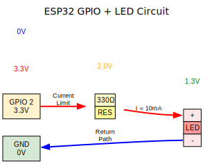
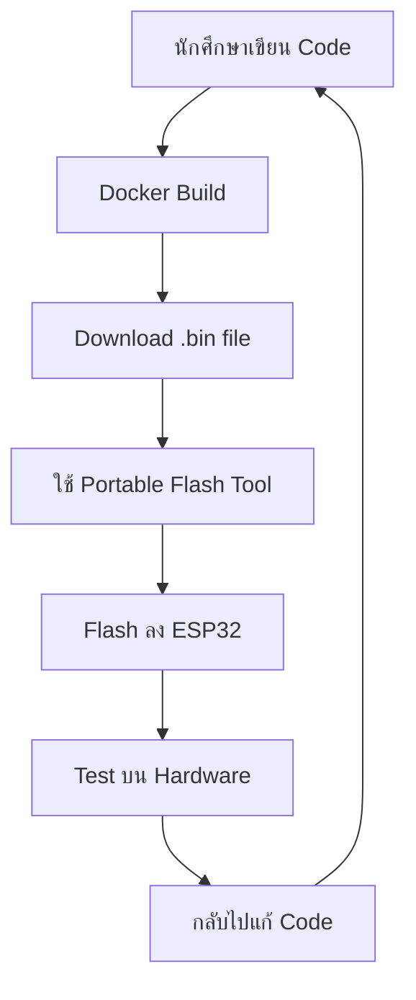
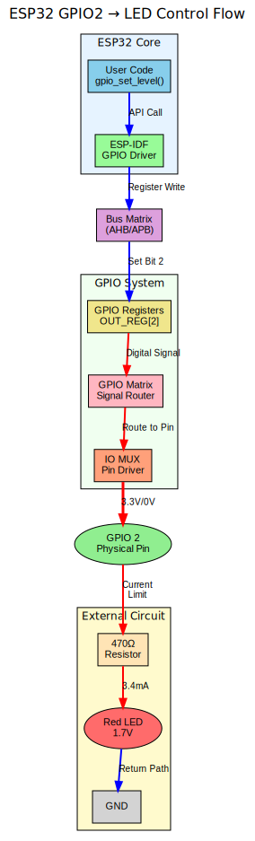

# 🧪 ESP32 GPIO Lab Worksheet

## 🎯 วัตถุประสงค์

หลังจากทำ Lab นี้แล้ว ผู้เรียนจะสามารถ:

1. เชื่อมต่อวงจร LED กับ ESP32 GPIO
2. เข้าใจการทำงานของ GPIO Data Flow
3. เขียนโปรแกรมควบคุม LED แบบ step-by-step
4. ใช้ ESP-IDF API สำหรับการควบคุม GPIO

---
ขาเชื่อมต่อใช้งานของ esp32 รุ่น 38 pin


---

## 🔧 Lab 1: การควบคุม LED พื้นฐาน

### ⚡ Hardware Setup

#### 📊 LED Circuit
### 🔧 Complete Implementation Example

**สำหรับผู้ที่ต้องการดู code แบบสมบูรณ์ที่ใช้ FreeRTOS Task และ proper structure:**




#### 🧮 การคำนวณค่า Resistor

``` cagram
```
**กฎของโอห์ม:**
$$V = I \times R$$

**สำหรับ LED Circuit:**
$$R = \frac{V_{supply} - V_{LED}}{I_{LED}}$$

**แทนค่าจริง (LED สีแดง + R 470Ω):**
$$I_{actual} = \frac{3.3V - 1.7V}{470\Omega} = \frac{1.6V}{470\Omega} = 3.40mA \text{ ✅ ปลอดภัย}$$

**กำลังงานที่สูญเสียที่ Resistor:**
$$P_R = I^2 \times R = (0.0034)^2 \times 470 = 0.0054W = 5.4mW$$

**กำลังงานที่ LED ใช้:**
$$P_{LED} = V_{LED} \times I = 1.7V \times 0.0034A = 0.0058W = 5.8mW$$
 

#### ⚡ PWM และ Timing การคำนวณ

**ความถี่ในการกะพริบ:**
$$f = \frac{1}{T} = \frac{1}{2 \times \text{delay}} = \frac{1}{2 \times 1000ms} = 0.5Hz$$

**Duty Cycle (หาก LED เปิด 70% ของเวลา):**
$$\text{Duty Cycle} = \frac{T_{ON}}{T_{ON} + T_{OFF}} \times 100\% = \frac{700ms}{1000ms} \times 100\% = 70\%$$

**กระแสเฉลี่ยสำหรับ PWM:**
$$I_{avg} = I_{peak} \times \frac{\text{Duty Cycle}}{100\%} = 3.40mA \times \frac{50\%}{100\%} = 1.70mA$$

**อายุการใช้งาน LED (ประมาณการ):**
$$\text{Lifetime} \propto \frac{1}{I_{avg}^2} \text{ (ยิ่งกระแสน้อย ยิ่งอยู่นาน)}$$
 
---


#### 🛠️ อุปกรณ์ที่ใช้

- ESP32 Development Board
- LED (สีแดง)
- Resistor 470Ω
- Breadboard
- Jumper wires

#### 🔌 การต่อวงจร

1. **GPIO 2** → **Resistor 470Ω** → **LED Anode (+)**
2. **LED Cathode (-)** → **GND**


> **⚠️ หมายเหตุ:** GPIO ของ ESP32 ให้กระแสได้สูงสุด 40mA ต่อ pin

---

## 🐳 Docker Environment Setup สำหรับห้องคอมพิวเตอร์ส่วนกลาง

### 🎯 ปัญหาที่พบบ่อย

1. **ไม่สามารถลง ESP-IDF ในเครื่อง** (เพราะจะหายหลังรีบูต)
2. **Docker ไม่สามารถเข้าถึง Serial Port** ใน Windows
3. **การ Flash firmware ผ่าน Docker** มีปัญหา

### 💡 วิธีแก้ปัญหา: Hybrid Development Approach

#### 🔧 Method 1: Docker สำหรับ Build + Host สำหรับ Flash

**1. ใช้ Docker เพื่อ compile code:**

```bash
# Build ใน Docker (ไม่ต้องลง ESP-IDF ในเครื่อง)
docker run --rm -v ${PWD}:/project -w /project espressif/idf:v5.1.2 idf.py build
```

**2. ใช้ esptool ใน host สำหรับ flash:**

```bash
# Download esptool แบบ standalone (ไม่ต้องลง Python environment)
# ดาวน์โหลดจาก: https://github.com/espressif/esptool/releases
# หรือใช้ pip install esptool ใน user environment

# Flash firmware
esptool.py --chip esp32 --port COM3 --baud 921600 write_flash 0x10000 build/your_project.bin
```

#### 🔧 Method 2: Docker with USB Device Passthrough (Windows)

**สำหรับ Windows + Docker Desktop:**

```yaml
# docker-compose.yml
version: '3.8'
services:
  esp-idf:
    image: espressif/idf:v5.1.2
    volumes:
      - .:/project
    working_dir: /project
    devices:
      - /dev/ttyUSB0:/dev/ttyUSB0  # สำหรับ Linux
    # Windows ต้องใช้ WSL2 และ usbipd-win
    privileged: true
    command: /bin/bash
```

**สำหรับ Windows 10/11 + WSL2:**

```bash
# 1. ลง usbipd-win ใน Windows host
winget install usbipd

# 2. ดู USB devices
usbipd wsl list

# 3. Attach ESP32 ไป WSL2
usbipd wsl attach --busid 4-2 --distribution Ubuntu

# 4. รัน Docker ใน WSL2
docker run --rm -v ${PWD}:/project --device=/dev/ttyUSB0 espressif/idf:v5.1.2
```

#### 🔧 Method 3: Web-based Development (แนะนำสำหรับห้องเรียน)

**ใช้ GitHub Codespaces หรือ Gitpod:**

```yaml
# .gitpod.yml
image: espressif/idf:v5.1.2
tasks:
  - init: echo "ESP-IDF environment ready"
    command: idf.py --version

vscode:
  extensions:
    - espressif.esp-idf-extension
```

**Workflow:**

1. นักศึกษาใช้ web browser เข้า Codespaces
2. Develop และ build ใน cloud
3. Download firmware file
4. ใช้ **ESP32 Flash Tool** (GUI) บน Windows เพื่อ flash

#### 🛠️ Quick Solution: Portable ESP32 Flash Tool

**ดาวน์โหลด tools ที่ไม่ต้องลง:**

```text
📁 ESP32-Lab-Tools/           (Portable folder สำหรับห้องเรียน)
├── esptool.exe              (Standalone executable)
├── esp32_flash_tool.exe     (GUI tool)
├── drivers/                 (CP210x/CH340 drivers)
└── README.txt               (วิธีใช้)
```

**การใช้งาน:**

1. แตกไฟล์ลง USB flash drive
2. เสียบ ESP32 เข้าคอมพิวเตอร์
3. รัน `esp32_flash_tool.exe`
4. เลือกไฟล์ .bin และ flash

### 🎓 แนะนำสำหรับห้องเรียน

#### 🥇 **Method 1 (แนะนำที่สุด): Docker Build + Portable Flash Tool**

**ข้อดี:**

- ไม่ต้องลงอะไรในเครื่อง (Docker pull image ครั้งเดียว)
- Flash tool เป็น portable executable
- นักศึกษาสามารถเอาไฟล์ไปทำต่อที่บ้านได้

**ขั้นตอนสำหรับครู:**

1. เตรียม USB drive มี ESP32 Flash Tool
2. สอนนักศึกษาใช้ `docker run` command
3. Flash ด้วย GUI tool

#### 🥈 **Method 3 (สำหรับเครื่องที่ไม่มี Docker): Web-based**

**ข้อดี:**

- ใช้แค่ web browser
- ไม่ต้องลงอะไรเลย
- Code เก็บใน cloud (sync across devices)

**ข้อเสีย:**

- ต้องมี internet
- ต้องมี GitHub account

#### 🏆 **Hybrid Workflow สำหรับห้องเรียน:**



**ไฟล์ที่ครูต้องเตรียม:**

```text
📁 ESP32-Lab-Kit/
├── 🐳 docker-commands.txt          (คำสั่ง Docker ที่ใช้บ่อย)
├── 📱 esp32-flash-tool.exe         (Portable flashing tool)
├── 🔧 cp210x-driver.exe           (Driver สำหรับ ESP32)
├── 📚 lab-templates/               (Template projects)
│   ├── 01-blink/
│   ├── 02-gpio/
│   └── 03-pwm/
└── 📖 README.md                   (วิธีใช้สำหรับนักศึกษา)
```

---

### 📊 GPIO Control Data Flow




#### 🔄 ขั้นตอนการทำงาน: User Code → LED


**รายละเอียดแต่ละขั้นตอน:**

1. **User Code** - เรียก `gpio_set_level(GPIO_NUM_2, 1)`
2. **ESP-IDF** - GPIO driver แปลงเป็น register operations
3. **Bus Matrix** - จัดการการเข้าถึง peripheral registers (AHB/APB bus)
4. **GPIO Registers** - เขียนค่าลง GPIO_OUT_REG bit 2
5. **GPIO Matrix** - route digital signal ไปยัง physical pin
6. **IO MUX** - ขับสัญญาณทางกายภาพ (3.3V/0V)
7. **GPIO2 Pin** - output แรงดัน 3.3V หรือ 0V
8. **LED Circuit** - LED สว่าง/ดับตามแรงดัน (ผ่าน 470Ω resistor)


### 💻 Lab 1: LED Basic Control (Step by Step)

#### 🎯 การเรียนรู้แบบเป็นขั้นตอน

**เป้าหมาย:** เริ่มจากง่ายที่สุด → ไปจนถึงการควบคุมแบบ advanced

```text
Step 1: LED ON (เข้าใจ GPIO basic)
    ↓
Step 2: LED OFF (เข้าใจการปิด LED)
    ↓
Step 3: LED Blink (FreeRTOS + วนลูป)
    ↓
Lab 2: PWM Breathing (LEDC + fade effects)
```

#### 🔧 Step 1: LED ON - โปรแกรมพื้นฐานที่สุด

**วัตถุประสงค์:** เข้าใจการ initialize GPIO และเปิด LED

```c
#include "freertos/FreeRTOS.h"
#include "freertos/task.h"
#include "driver/gpio.h"
#include "esp_log.h"

#define LED_GPIO GPIO_NUM_2

void app_main(void) {
    // กำหนด GPIO 2 เป็น output
    gpio_set_direction(LED_GPIO, GPIO_MODE_OUTPUT);
    
    // เปิด LED (HIGH = 3.3V)
    gpio_set_level(LED_GPIO, 1);
    
    ESP_LOGI("LED", "LED is ON!");
    
    // ป้องกันโปรแกรมจบทันที (รอ forever)
    while(1) {
        vTaskDelay(pdMS_TO_TICKS(1000));
    }
}
```

**ผลลัพธ์:** LED จะสว่างและเปิดค้างไว้

---

#### 🔧 Step 2: LED OFF - เข้าใจการปิด LED

**วัตถุประสงค์:** เรียนรู้การปิด LED

```c
#include "freertos/FreeRTOS.h"
#include "freertos/task.h"
#include "driver/gpio.h"
#include "esp_log.h"

#define LED_GPIO GPIO_NUM_2

void app_main(void) {
    // กำหนด GPIO 2 เป็น output
    gpio_set_direction(LED_GPIO, GPIO_MODE_OUTPUT);
    
    // เปิด LED ก่อน (HIGH = 3.3V)
    gpio_set_level(LED_GPIO, 1);
    ESP_LOGI("LED", "LED is ON for 3 seconds...");
    
    // รอ 3 วินาที
    vTaskDelay(pdMS_TO_TICKS(3000));
    
    // ปิด LED (LOW = 0V)
    gpio_set_level(LED_GPIO, 0);
    ESP_LOGI("LED", "LED is OFF!");
    
    // ป้องกันโปรแกรมจบทันที (รอ forever)
    while(1) {
        vTaskDelay(pdMS_TO_TICKS(1000));
    }
}
```

**ผลลัพธ์:** LED จะติด 3 วินาทีแล้วดับ

---

#### 🔧 Step 3: LED Blink - การควบคุมแบบวนลูป

**วัตถุประสงค์:** เรียนรู้ FreeRTOS delay และ infinite loop

```c
#include "freertos/FreeRTOS.h"
#include "freertos/task.h"
#include "driver/gpio.h"
#include "esp_log.h"

#define LED_GPIO GPIO_NUM_2
#define BLINK_PERIOD 1000  // 1 วินาที

void app_main(void) {
    gpio_set_direction(LED_GPIO, GPIO_MODE_OUTPUT);
    
    bool led_state = false;
    
    while (1) {
        // สลับสถานะ LED
        led_state = !led_state;
        gpio_set_level(LED_GPIO, led_state);
        
        ESP_LOGI("LED", "LED is %s", led_state ? "ON" : "OFF");
        
        // หน่วงเวลา 1 วินาที
        vTaskDelay(pdMS_TO_TICKS(BLINK_PERIOD));
    }
}
```

**ผลลัพธ์:** LED จะกระพริบทุก 1 วินาที

---

## 🌟 Lab 2: PWM Breathing Effect

### 🎯 เป้าหมาย: LED หายใจเข้า-ออกแบบนุ่มนวล

**แนวคิด:** ใช้ PWM ปรับความสว่างแบบค่อยเป็นค่อยไป เลียนแบบการหายใจ

### ⚡ PWM Theory

**PWM (Pulse Width Modulation):**
$$\text{Brightness} \propto \text{Duty Cycle} = \frac{T_{ON}}{T_{PERIOD}} \times 100\%$$

**การคำนวณ PWM Resolution:**
$$\text{Steps} = 2^{\text{Resolution}} = 2^{13} = 8192 \text{ levels}$$

**ความถี่ PWM:**
$$f_{PWM} = \frac{\text{Clock}}{2^{\text{Resolution}} \times \text{Prescaler}} = \frac{80MHz}{8192 \times 1} = 9.76kHz$$

#### 🔧 Step 4: PWM Breathing Implementation

```c
#include "freertos/FreeRTOS.h"
#include "freertos/task.h"
#include "driver/ledc.h"
#include "esp_log.h"

#define LED_GPIO        GPIO_NUM_2
#define LEDC_TIMER      LEDC_TIMER_0
#define LEDC_MODE       LEDC_LOW_SPEED_MODE
#define LEDC_CHANNEL    LEDC_CHANNEL_0
#define LEDC_DUTY_RES   LEDC_TIMER_13_BIT  // 8192 levels
#define LEDC_FREQUENCY  5000               // 5kHz
#define FADE_TIME       3000               // 3 วินาที

static const char *TAG = "PWM_BREATHING";

void ledc_init(void) {
    // Configure timer
    ledc_timer_config_t ledc_timer = {
        .duty_resolution = LEDC_DUTY_RES,
        .freq_hz = LEDC_FREQUENCY,
        .speed_mode = LEDC_MODE,
        .timer_num = LEDC_TIMER,
        .clk_cfg = LEDC_AUTO_CLK,
    };
    ESP_ERROR_CHECK(ledc_timer_config(&ledc_timer));

    // Configure channel
    ledc_channel_config_t ledc_channel = {
        .channel    = LEDC_CHANNEL,
        .duty       = 0,
        .gpio_num   = LED_GPIO,
        .speed_mode = LEDC_MODE,
        .hpoint     = 0,
        .timer_sel  = LEDC_TIMER,
    };
    ESP_ERROR_CHECK(ledc_channel_config(&ledc_channel));
    
    // Initialize fade service
    ESP_ERROR_CHECK(ledc_fade_func_install(0));
}

void app_main(void) {
    ESP_LOGI(TAG, "Starting PWM Breathing Effect");
    
    // Initialize PWM
    ledc_init();
    
    while (1) {
        // หายใจเข้า (Fade IN: 0% → 100%)
        ESP_LOGI(TAG, "Breathing IN...");
        ESP_ERROR_CHECK(ledc_set_fade_with_time(LEDC_MODE, 
            LEDC_CHANNEL, 8191, FADE_TIME));
        ESP_ERROR_CHECK(ledc_fade_start(LEDC_MODE, 
            LEDC_CHANNEL, LEDC_FADE_WAIT_DONE));
        
        // หายใจออก (Fade OUT: 100% → 0%)
        ESP_LOGI(TAG, "Breathing OUT...");
        ESP_ERROR_CHECK(ledc_set_fade_with_time(LEDC_MODE, 
            LEDC_CHANNEL, 0, FADE_TIME));
        ESP_ERROR_CHECK(ledc_fade_start(LEDC_MODE, 
            LEDC_CHANNEL, LEDC_FADE_WAIT_DONE));
    }
}
```

**ผลลัพธ์:** LED จะค่อยๆ สว่างขึ้น (3 วินาที) แล้วค่อยๆ มืดลง (3 วินาที) วนลูปไปเรื่อยๆ

#### � PWM Breathing Analysis

**การคำนวณ Breathing Pattern:**
$$\text{Duty}(t) = \frac{8191}{2} \times (1 + \sin(\frac{2\pi t}{T_{period}}))$$

**โดยที่:**

- $T_{period} = 6$ วินาที (3 วินาที เข้า + 3 วินาที ออก)
- $\text{Duty}(t)$ = ค่า duty cycle ณ เวลา $t$
- ช่วง duty: 0 ถึง 8191 (13-bit resolution)

**กระแสเฉลี่ยในโหมด Breathing:**
$$I_{avg} = I_{peak} \times \frac{1}{T} \int_0^T \frac{\text{Duty}(t)}{8191} dt = \frac{I_{peak}}{2} = 1.70mA$$

---

### 🎓 Lab Summary

| Step | Lab | Objective | Key Learning |
|------|-----|-----------|--------------|
| **Step 1** | **Lab 1.1** | LED ON | GPIO initialization, basic output |
| **Step 2** | **Lab 1.2** | LED OFF | GPIO control, digital LOW |
| **Step 3** | **Lab 1.3** | LED Blink | FreeRTOS delay, infinite loops |
| **Lab 2** | **PWM Lab** | PWM Breathing | PWM/LEDC, fade effects, analog-like control |

### 🔄 Learning Progression

```text
Lab 1: Digital GPIO Control
├── Step 1: Basic GPIO OUTPUT (เรียนรู้พื้นฐาน)
├── Step 2: GPIO State Control (เรียนรู้การปิด)
└── Step 3: Dynamic Control (เรียนรู้ timing + loops)

Lab 2: Analog-like Control  
└── PWM Breathing (เรียนรู้ PWM + smooth transitions)
```

### � Complete Implementation Example

```c
#include <stdio.h>
#include "freertos/FreeRTOS.h"
#include "freertos/task.h"
#include "driver/gpio.h"
#include "esp_log.h"

// กำหนดค่าคงที่
#define LED_GPIO    GPIO_NUM_2      // ใช้ GPIO 2
#define BLINK_PERIOD 1000          // 1 วินาที (1000ms)

static const char *TAG = "LED_CONTROL";

/**
 * @brief กำหนดค่าเริ่มต้นสำหรับ GPIO
 */
void led_init(void) {
    ESP_LOGI(TAG, "Initializing LED on GPIO %d", LED_GPIO);
    
    // 1️⃣ สร้าง GPIO configuration structure
    gpio_config_t io_conf = {0};
    
    // 2️⃣ กำหนด pin ที่ต้องการใช้ (bit mask)
    io_conf.pin_bit_mask = (1ULL << LED_GPIO);
    
    // 3️⃣ กำหนดเป็น output mode
    io_conf.mode = GPIO_MODE_OUTPUT;
    
    // 4️⃣ ปิด pull-up/pull-down (ไม่จำเป็นสำหรับ output)
    io_conf.pull_up_en = GPIO_PULLUP_DISABLE;
    io_conf.pull_down_en = GPIO_PULLDOWN_DISABLE;
    
    // 5️⃣ ปิด interrupt (ไม่ใช้ในการควบคุม LED)
    io_conf.intr_type = GPIO_INTR_DISABLE;
    
    // 6️⃣ Apply configuration
    ESP_ERROR_CHECK(gpio_config(&io_conf));
    
    // 7️⃣ Set initial state (LED OFF)
    gpio_set_level(LED_GPIO, 0);
    
    ESP_LOGI(TAG, "LED initialization completed");
}

/**
 * @brief ควบคุม LED (เปิด/ปิด)
 * @param state: 1 = LED ON, 0 = LED OFF
 */
void led_control(int state) {
    gpio_set_level(LED_GPIO, state);
    ESP_LOGI(TAG, "LED %s", state ? "ON" : "OFF");
}

/**
 * @brief Task สำหรับกระพริบ LED
 */
void led_blink_task(void *pvParameters) {
    int led_state = 0;
    
    while (1) {
        // สลับสถานะ LED
        led_state = !led_state;
        led_control(led_state);
        
        // หน่วงเวลา
        vTaskDelay(pdMS_TO_TICKS(BLINK_PERIOD));
    }
}

/**
 * @brief Main application entry point
 */
void app_main(void) {
    ESP_LOGI(TAG, "ESP32 LED Control Demo Started");
    
    // Initialize LED
    led_init();
    
    // Create LED blink task
    xTaskCreate(
        led_blink_task,          // Function pointer
        "led_blink_task",        // Task name
        2048,                    // Stack size (bytes)
        NULL,                    // Parameters
        5,                       // Priority
        NULL                     // Task handle
    );
    
    ESP_LOGI(TAG, "LED blink task created");
}
```

#### 🔧 Step 3: CMakeLists.txt

```cmake
idf_component_register(SRCS "main.c"
                      INCLUDE_DIRS ".")
```

#### 🔧 Step 4: Build และ Flash

```bash
# Configure target
idf.py set-target esp32

# Build project
idf.py build

# Flash to ESP32
idf.py flash

# Monitor output
idf.py monitor
```

---

### 🔍 Code Analysis

#### 📋 การทำงานของแต่ละส่วน

##### 1️⃣ **GPIO Configuration Structure**

```c
gpio_config_t io_conf = {
    .pin_bit_mask = (1ULL << LED_GPIO),  // Select pin
    .mode = GPIO_MODE_OUTPUT,            // Output mode
    .pull_up_en = GPIO_PULLUP_DISABLE,   // No pull-up
    .pull_down_en = GPIO_PULLDOWN_DISABLE, // No pull-down
    .intr_type = GPIO_INTR_DISABLE       // No interrupt
};
```

##### 2️⃣ **Register-Level Operations**

```c
// เบื้องหลังของ gpio_set_level()
gpio_set_level(LED_GPIO, 1);  // LED ON
// ↓ ภายในจะทำ:
// REG_WRITE(GPIO_OUT_W1TS_REG, (1 << LED_GPIO));

gpio_set_level(LED_GPIO, 0);  // LED OFF  
// ↓ ภายในจะทำ:
// REG_WRITE(GPIO_OUT_W1TC_REG, (1 << LED_GPIO));
```

##### 3️⃣ **FreeRTOS Task Management**

```c
xTaskCreate(
    led_blink_task,    // Task function
    "led_blink_task",  // Task name (for debugging)
    2048,              // Stack size (sufficient for simple GPIO)
    NULL,              // No parameters passed
    5,                 // Priority (1-25, higher = more priority)
    NULL               // Don't need task handle
);
```

---

### 📊 Expected Output

#### 🖥️ Serial Monitor Output

```text
I (320) LED_CONTROL: ESP32 LED Control Demo Started
I (320) LED_CONTROL: Initializing LED on GPIO 2
I (330) LED_CONTROL: LED initialization completed
I (330) LED_CONTROL: LED blink task created
I (340) LED_CONTROL: LED ON
I (1340) LED_CONTROL: LED OFF
I (2340) LED_CONTROL: LED ON
I (3340) LED_CONTROL: LED OFF
...
```

#### 💡 Physical Behavior

- LED จะกระพริบทุก 1 วินาที
- สถานะจะแสดงใน Serial Monitor
- ตรวจสอบการต่อวงจรถ้า LED ไม่ทำงาน

---

## 🚀 Advanced Exercises

### 🔧 Exercise 1: Multiple LEDs

แก้ไข code ให้ควบคุม LED 3 ดวงพร้อมกัน (GPIO 2, 4, 5)

```c
#define LED1_GPIO GPIO_NUM_2
#define LED2_GPIO GPIO_NUM_4  
#define LED3_GPIO GPIO_NUM_5

// TODO: แก้ไข led_init() และ led_blink_task()
```

### 🔧 Exercise 2: LED Patterns

สร้างรูปแบบการกระพริบ:

- **Knight Rider (วิ่งไปมา)** - LED เคลื่อนที่ไปมา
- **Binary Counter (นับเลขฐาน 2)** - แสดงเลขฐาน 2
- **Random Blinking** - กระพริบแบบสุ่ม

---

### 🔧 Exercise 3: LED Patterns ท้าทายอีกขั้น

สร้างรูปแบบการกระพริบเหมือน Exercise 2 แต่เป็นจังหวะการหายใจ

- **Knight Rider (วิ่งไปมา)** - LED เคลื่อนที่ไปมา
- **Binary Counter (นับเลขฐาน 2)** - แสดงเลขฐาน 2
- **Random Blinking** - กระพริบแบบสุ่ม


## 📚 Additional Resources

### 🔗 ESP-IDF Documentation

- [GPIO Driver](https://docs.espressif.com/projects/esp-idf/en/latest/esp32/api-reference/peripherals/gpio.html)
- [FreeRTOS Tasks](https://docs.espressif.com/projects/esp-idf/en/latest/esp32/api-reference/system/freertos.html)

### 🛠️ Troubleshooting

- **LED ไม่สว่าง:** ตรวจสอบการต่อวงจร, ขั้วของ LED
- **Compile Error:** ตรวจสอบ ESP-IDF environment setup
- **Flash Error:** ตรวจสอบการเชื่อมต่อ USB cable

### 📖 Reference Materials

- [ESP32-GPIO-Knowledge-Sheet.md](ESP32-GPIO-Knowledge-Sheet.md) - ทฤษฎีเชิงลึก
- ESP32 GPIO Pinout และ Constraints
- FreeRTOS Task Programming Guide

---

*📅 Created: September 2025*  
*👨‍💻 For: ESP32 GPIO Practical Lab*
