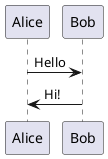

# PlantUML Local Installation - SUCCESS! ✅

## สิ่งที่ติดตั้งแล้ว:

### ✅ PlantUML JAR (22.6 MB)
- **Location**: `C:\Tools\PlantUML\plantuml.jar`
- **Batch file**: `C:\Tools\PlantUML\plantuml.bat`

### ✅ VS Code Settings  
- **Render mode**: Local
- **JAR path**: Configured

## การใช้งาน:

### 1. Command Line (หลัง Java ติดตั้งเสร็จ):
```powershell
# ทดสอบ PlantUML
java -jar "C:\Tools\PlantUML\plantuml.jar" -version

# สร้างรูปจากไฟล์ .puml
java -jar "C:\Tools\PlantUML\plantuml.jar" esp32_architecture.puml

# สร้างรูปแบบต่างๆ
java -jar "C:\Tools\PlantUML\plantuml.jar" -tpng esp32_architecture.puml
java -jar "C:\Tools\PlantUML\plantuml.jar" -tsvg esp32_architecture.puml
java -jar "C:\Tools\PlantUML\plantuml.jar" -tpdf esp32_architecture.puml

# สร้างทุกไฟล์ .puml ในโฟลเดอร์
java -jar "C:\Tools\PlantUML\plantuml.jar" *.puml
```

### 2. VS Code:
- เปิดไฟล์ `.puml`
- กด **Alt+D** เพื่อ preview
- กด **Ctrl+Shift+P** → "PlantUML: Export Current Diagram"

### 3. Batch File (สำหรับความสะดวก):
```powershell
# เพิ่ม PATH ถาวร
$env:PATH += ";C:\Tools\PlantUML"

# ใช้งาน
plantuml esp32_architecture.puml
plantuml -tsvg esp32_architecture.puml
```

## ตัวอย่างการทดสอบ:

### สร้างไฟล์ทดสอบ:


### รันคำสั่ง:
```powershell
# สร้างรูป
java -jar "C:\Tools\PlantUML\plantuml.jar" test.puml

# ผลลัพธ์: test.png
```

## การแก้ปัญหา:

### หาก Java ยังไม่ทำงาน:
1. **รอให้ติดตั้งเสร็จ**
2. **Restart PowerShell**
3. **ลองใหม่**: `java -version`

### หาก VS Code ยังมีปัญหา:
1. **Restart VS Code**
2. **ตรวจสอบ settings.json**
3. **ลองกด Alt+D ในไฟล์ .puml**

## ข้อดีของ Local Installation:

✅ **ความเร็วสูง** - ไม่ต้องส่งข้อมูลออนไลน์  
✅ **ความปลอดภัย** - ข้อมูลไม่ออกจากเครื่อง  
✅ **ใช้งาน Offline** - ไม่ต้องอินเทอร์เน็ต  
✅ **เสถียร** - ไม่พึ่ง external server  
✅ **เร็ว** - render ที่เครื่องเอง  

## Status:
- ✅ PlantUML JAR: Downloaded & Ready
- ⏳ Java: Installing...
- ✅ VS Code: Configured
- 🎯 Ready to use once Java is installed!

ลองรัน `java -version` ทุกๆ นาทีจนได้ แล้วจะใช้งาน PlantUML local ได้เลย! 🚀
