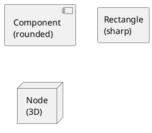

# รูปร่างต่างๆ ใน PlantUML

## รูปร่างพื้นฐาน:
- `component` → สี่เหลี่ยมข้าวหลามตัด (rounded rectangle) 
- `rectangle` → สี่เหลี่ยมผืนผ้าตรง (sharp rectangle)
- `node` → สี่เหลี่ยมมุมโค้ง 3D
- `package` → โฟลเดอร์
- `database` → ฐานข้อมูล
- `cloud` → เมฆ
- `actor` → คน
- `interface` → วงกลม

## สำหรับ Bus Matrix และ GPIO ที่ต้องการเป็นสี่เหลี่ยมผืนผ้า:
```plantuml
' เปลี่ยนจาก component เป็น rectangle
rectangle [Interconnect\nBus Matrix\nArbitrator] as MATRIX #Orange
rectangle [GPIO PINS\n40 pins available\nMulti-function I/O] as GPIO #LightCyan

' หรือใช้ node สำหรับ 3D effect
node [Interconnect\nBus Matrix\nArbitrator] as MATRIX #Orange
node [GPIO PINS\n40 pins available\nMulti-function I/O] as GPIO #LightCyan
```

## ตัวอย่างเปรียบเทียบ:

