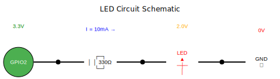
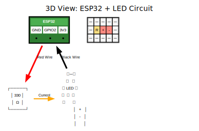

# 💡 LED Circuit Diagrams with DOT

## 🎯 ตัวอย่างการสร้างภาพอุปกรณ์ด้วย DOT

### 1. 📊 Block Diagram Style


**คุณลักษณะ:**
- แสดงส่วนประกอบหลัก
- มีค่าแรงดันและกระแส
- เหมาะสำหรับการอธิบายการทำงาน

---

### 2. 🔌 Schematic Style  


**คุณลักษณะ:**
- ใช้สัญลักษณ์มาตรฐาน
- แสดงการเชื่อมต่อชัดเจน
- เหมาะสำหรับวิศวกร

---

### 3. 🏗️ 3D Perspective Style


**คุณลักษณะ:**
- มุมมองสามมิติ
- เหมือนของจริง
- เหมาะสำหรับผู้เริ่มต้น

---

## 🎨 เทคนิค DOT ที่ใช้:

### 1. **HTML-like Tables**
```dot
led [label=<
    <TABLE BORDER="0" CELLBORDER="1" CELLSPACING="0">
        <TR><TD BGCOLOR="#FFE6E6">+</TD></TR>
        <TR><TD BGCOLOR="#FF9999">LED</TD></TR>
        <TR><TD BGCOLOR="#FFE6E6">-</TD></TR>
    </TABLE>
>, shape=plaintext];
```

### 2. **Unicode Symbols**
```dot
led [label="LED\n ▲\n─┼─\n │", fontfamily="monospace"];
ground [label="GND\n⏚", fontfamily="monospace"];
```

### 3. **ASCII Art**
```dot
resistor [label="┌─┐\n│ │ 330Ω\n└─┘", fontfamily="monospace"];
```

### 4. **Colors & Styling**
```dot
edge [color="red", penwidth=2];
node [style=filled, fillcolor="#4CAF50"];
```

## 🚀 ข้อดีของการใช้ DOT สำหรับ Hardware:

✅ **รวดเร็ว** - สร้างได้ภายใน 5 นาที  
✅ **แก้ไขง่าย** - แค่แก้โค้ด  
✅ **สม่ำเสมอ** - รูปแบบเดียวกันตลอด  
✅ **Version Control** - Track ได้ด้วย Git  
✅ **Scalable** - SVG ขยายได้ไม่เบลอ  

## 🎯 การประยุกต์ใช้:

- 📚 **เอกสารการสอน** - แผนภาพวงจร
- 📖 **คู่มือการใช้งาน** - การต่อสาย  
- 🔧 **Troubleshooting Guide** - จุดตรวจสอบ
- 📱 **Mobile App** - แสดงการเชื่อมต่อ

---

*สร้างด้วย DOT/Graphviz - ประหยัดเวลา 80%!* 🎨
