# 🧪 ESP32 GPIO Lab - Docker Setup Guide

## 📋 สิ่งที่ต้องเตรียม

### สำหรับนักศึกษา:
- [x] คอมพิวเตอร์ที่มี Docker Desktop
- [x] ESP32 Development Board
- [x] สายสำหรับต่อ ESP32 (USB Type-C หรือ Micro-USB)
- [x] Breadboard + LED + Resistor 470Ω + Jumper wires

### สำหรับครู:
- [x] USB Flash Drive มี ESP32 Flash Tool
- [x] ไฟล์ Docker commands และ templates

## 🚀 Quick Start (5 นาทีแรก)

### 1. ทำความรู้จักกับ Docker

```bash
# ตรวจสอบว่า Docker ทำงานได้หรือไม่
docker --version

# Pull ESP-IDF image (ครั้งแรกเท่านั้น - ใช้เวลา 5-10 นาที)
docker pull espressif/idf:v5.1.2
```

### 2. สร้าง Project แรก

```bash
# สร้าง directory ใหม่
mkdir my_first_esp32
cd my_first_esp32

# สร้าง project structure
docker run --rm -v ${PWD}:/project -w /project espressif/idf:v5.1.2 idf.py create-project led_blink
cd led_blink
```

### 3. Build Project

```bash
# Build project
docker run --rm -v ${PWD}:/project -w /project espressif/idf:v5.1.2 idf.py build
```

**ผลลัพธ์ที่คาดหวัง:**
```
Project build complete. To flash, run this command:
idf.py -p (PORT) flash monitor
```

**ไฟล์ที่สำคัญหลัง build:**
- `build/led_blink.bin` - ไฟล์ firmware ที่จะ flash ลง ESP32

## 📱 Flash Firmware ลง ESP32

### วิธีที่ 1: ใช้ ESP32 Flash Tool (แนะนำ)

1. **เสียบ ESP32** เข้าคอมพิวเตอร์
2. **เปิด ESP32 Flash Tool** (ใน USB drive ที่ครูเตรียมไว้)
3. **เลือก COM Port** (เช่น COM3, COM4)
4. **เลือกไฟล์** `build/led_blink.bin`
5. **ตั้งค่า Address:** `0x10000`
6. **กด Flash**

### วิธีที่ 2: ใช้ Command Line (สำหรับคนที่อยากลอง)

```bash
# ติดตั้ง esptool (ครั้งเดียว)
pip install esptool

# Flash firmware
esptool.py --chip esp32 --port COM3 --baud 921600 write_flash 0x10000 build/led_blink.bin
```

## 🔧 Development Workflow

```mermaid
graph LR
    A[เขียน Code] --> B[Docker Build]
    B --> C[Flash ลง ESP32]
    C --> D[Test Hardware]
    D --> E[ดู Result]
    E --> A
```



### ขั้นตอนรายละเอียด:

1. **เขียน Code** - แก้ไข `main/main.c`
2. **Build** - รัน `docker run --rm -v ${PWD}:/project -w /project espressif/idf:v5.1.2 idf.py build`
3. **Flash** - ใช้ ESP32 Flash Tool
4. **Test** - ดูผลลัพธ์บน LED/Serial Monitor
5. **Debug** - กลับไปแก้ code

## 📂 Project Structure

```
led_blink/
├── CMakeLists.txt          # Project configuration
├── main/                  
│   ├── CMakeLists.txt     
│   └── main.c              # ← โค้ดหลักเขียนที่นี่
├── build/                  # Build output
│   └── led_blink.bin       # ← ไฟล์ที่ flash ลง ESP32
└── sdkconfig               # ESP-IDF configuration
```

## 🎯 Lab Activities

### Lab 1: LED Control

**Goal:** เปิด-ปิด LED ด้วย GPIO

```c
#include "driver/gpio.h"
#include "freertos/FreeRTOS.h"
#include "freertos/task.h"

#define LED_GPIO GPIO_NUM_2

void app_main(void) {
    gpio_set_direction(LED_GPIO, GPIO_MODE_OUTPUT);
    
    while(1) {
        gpio_set_level(LED_GPIO, 1);  // LED ON
        vTaskDelay(pdMS_TO_TICKS(1000));
        
        gpio_set_level(LED_GPIO, 0);  // LED OFF
        vTaskDelay(pdMS_TO_TICKS(1000));
    }
}
```

**การต่อวงจร:**
- GPIO2 → Resistor 470Ω → LED(+)
- LED(-) → GND

## 🛠️ Troubleshooting

### ปัญหาที่พบบ่อย:

**1. Docker image download ช้า**
- ใช้ WiFi ที่เร็ว หรือให้ครูเตรียม image ไว้ใน USB

**2. COM Port ไม่เจอ**
- ตรวจสอบ driver ESP32 (CP210x/CH340)
- ลองเปลี่ยน USB port
- ดู Device Manager

**3. Flash ไม่สำเร็จ**
- กด Boot button บน ESP32 ค้างไว้ขณะ flash
- ตรวจสอบสายต่อ
- ลดความเร็ว baud rate เป็น 115200

**4. LED ไม่สว่าง**
- ตรวจสอบการต่อวงจร (GPIO2 → R → LED+ → LED- → GND)
- ตรวจสอบขั้วของ LED
- เปลี่ยน LED หรือ Resistor

**5. Code ไม่ compile**
- ตรวจสอบ syntax error
- ลองใช้ template code ก่อน

## 📚 เอกสารเพิ่มเติม

- [ESP32-GPIO-Worksheet.md](ESP32-GPIO-Worksheet.md) - คู่มือ Lab ฉบับสมบูรณ์
- [docker-commands.md](docker-commands.md) - รวมคำสั่ง Docker ที่ใช้บ่อย
- [ESP-IDF Programming Guide](https://docs.espressif.com/projects/esp-idf/en/latest/)

## 🆘 ขอความช่วยเหลือ

**ถ้าติดปัญหา:**
1. อ่าน error message ให้ดี
2. ลองดู Troubleshooting ข้างบน
3. ถามเพื่อนหรือครู
4. Google ด้วย keyword ที่เกี่ยวข้อง

**ติดต่อครู:**
- อีเมล: [ระบุอีเมลครู]
- Line: [ระบุ Line ID]
- ในห้องเรียน: ยกมือครับ! 🙋‍♂️

---

*สร้างโดย: [ชื่อครู]*  
*วันที่: เมษายน 2025*  
*Lab: ESP32 GPIO with Docker*
