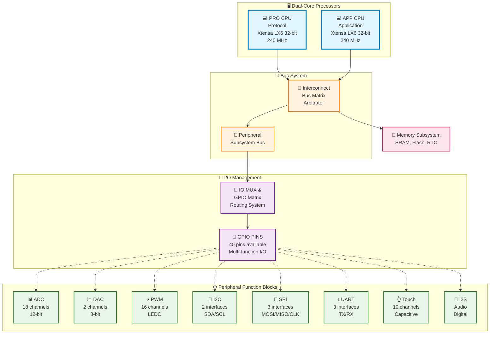

# สถาปัตยกรรม ESP32: การทำงานของ GPIO และการเชื่อมต่อกับ CPU

## ภาพรวมสถาปัตยกรรม ESP32

ESP32 เป็นไมโครคอนโทรลเลอร์ที่มีสถาปัตยกรรมแบบ **Dual-core** ที่ประกอบด้วย:
- **PRO CPU** (Protocol CPU) - โปรเซสเซอร์หลักสำหรับงานโปรโตคอลและการสื่อสาร
- **APP CPU** (Application CPU) - โปรเซสเซอร์สำหรับงานแอปพลิเคชัน

ทั้งสอง CPU เป็นแบบ **Xtensa LX6 32-bit** ที่ทำงานที่ความเร็วสูงสุด 240 MHz

## Block Diagram สถาปัตยกรรม ESP32

### แบบ ASCII Art (เดิม)
```
┌─────────────┐    ┌─────────────┐
│   PRO CPU   │    │   APP CPU   │
│  (Protocol) │    │(Application)│
└──────┬──────┘    └──────┬──────┘
       │                  │
       └────────┬─────────┘
                │
        ┌───────▼───────┐
        │ Interconnect  │
        │   Bus Matrix  │
        └───────┬───────┘
                │
        ┌───────▼───────┐
        │ Peripheral    │
        │   Subsystem   │
        └───────┬───────┘
                │
        ┌───────▼───────┐
        │  IO MUX &     │
        │  GPIO Matrix  │
        └───────┬───────┘
                │
    ┌───────────▼───────────┐
    │      GPIO PINS        │
    │  (40 pins available)  │
    └───────────┬───────────┘
                │
    ┌───────────▼───────────┐
    │   Peripheral Blocks   │
    ├───┬───┬───┬───┬───┬───┤
    │ADC│DAC│PWM│I2C│SPI│URT│
    └───┴───┴───┴───┴───┴───┘
```

### แบบ Vector Graphics (SVG) - คุณภาพสูง

<div align="center">
    
</div>

> **💡 หมายเหตุ**: SVG จะแสดงผลได้ดีใน GitHub และรองรับการขยายไม่เสียคุณภาพ

### แบบ Mermaid (สำหรับ GitHub/Modern Markdown)


> **📂 ไฟล์เพิ่มเติม**: สำหรับการสร้าง diagram คุณภาพสูง สามารถใช้ไฟล์ที่แนบมา:
> - `esp32_architecture.dot` (Graphviz)
> - `esp32_architecture.puml` (PlantUML) 
> - `diagram_tools_guide.md` (คู่มือเครื่องมือ)
> - `svg_in_github_guide.md` (คู่มือการใช้ SVG ใน GitHub)

## ความสามารถของ GPIO แต่ละขา

ESP32 มี GPIO จำนวน **40 ขา** ที่สามารถกำหนดการทำงานได้หลากหลาย:

### 1. Digital Input/Output
- **Digital Input**: อ่านสถานะ HIGH (3.3V) หรือ LOW (0V)
- **Digital Output**: ส่งสัญญาณ HIGH หรือ LOW ออกมา
- รองรับ **Pull-up** และ **Pull-down** resistor ภายใน

### 2. Analog Functions
- **ADC (Analog to Digital Converter)**: 
  - 18 ช่อง ADC ความละเอียด 12-bit
  - ช่วงแรงดัน 0-3.3V
  - รองรับ attenuation สำหรับขยายช่วงการวัด
- **DAC (Digital to Analog Converter)**:
  - 2 ช่อง DAC ความละเอียด 8-bit
  - ใช้กับขา GPIO25 และ GPIO26

### 3. Touch Sensor
- **Capacitive Touch**: 10 ช่อง
- ตรวจจับการสัมผัสผ่านการเปลี่ยนแปลงของความจุไฟฟ้า

### 4. PWM (Pulse Width Modulation)
- **16 ช่อง PWM** ควบคุมได้อิสระ
- ความเร็วสูงสุด 40 MHz
- ใช้สำหรับควบคุมความสว่าง LED, มอเตอร์ servo

### 5. Communication Interfaces
- **I2C**: 2 interface (SDA, SCL)
- **SPI**: 3 interface (MOSI, MISO, CLK, CS)
- **UART**: 3 interface (TX, RX)
- **I2S**: สำหรับเสียงดิจิทัล

## การเชื่อมต่อ GPIO กับ PRO CPU และ APP CPU

### Bus Architecture
```
PRO CPU ──┐
          ├── AHB Bus ──┐
APP CPU ──┘             │
                        ▼
                  ┌─────────────┐
                  │ Bus Matrix  │
                  │ Arbitrator  │
                  └─────┬───────┘
                        │
                  ┌─────▼───────┐
                  │ Peripheral  │
                  │    Bus      │
                  └─────┬───────┘
                        │
                  ┌─────▼───────┐
                  │ GPIO Module │
                  └─────────────┘
```

### การเข้าถึง GPIO
1. **ทั้งสอง CPU** สามารถเข้าถึง GPIO ได้ผ่าน **Peripheral Bus**
2. **Bus Matrix Arbitrator** จัดการลำดับความสำคัญเมื่อทั้งสอง CPU เข้าถึงพร้อมกัน
3. **Memory Mapped I/O** ทำให้สามารถควบคุม GPIO ผ่าน register address

## IO MUX และ GPIO Matrix

### IO MUX (Input/Output Multiplexer)
```
GPIO Pin ──┐
           ├── IO MUX ──┐
           │            ├── Function 0 (GPIO)
           │            ├── Function 1 (UART)
           │            ├── Function 2 (SPI)
           │            └── Function n (Other)
           │
         Peripheral ────┘
```

### GPIO Matrix
GPIO Matrix เป็นระบบที่ให้ความยืดหยุ่นในการเชื่อมต่อ:

```
┌──────────────┐    ┌──────────────┐    ┌──────────────┐
│ Peripheral   │    │ GPIO Matrix  │    │  Physical    │
│   Signals    │◄──►│   Routing    │◄──►│  GPIO Pins   │
│              │    │    System    │    │              │
└──────────────┘    └──────────────┘    └──────────────┘
        ▲                   ▲                   ▲
        │                   │                   │
     256 Input           Flexible            40 Pins
    128 Output          Routing Matrix
```

## การควบคุมผ่าน Register

### Register Groups สำคัญ

#### 1. GPIO Function Select Register
```c
// เลือกฟังก์ชันของขา GPIO
GPIO.func_out_sel_cfg[pin_num].val = function_select;
```

#### 2. GPIO Direction Control
```c
// กำหนดทิศทางของขา
GPIO.enable_reg.val |= (1 << pin_num);     // Output
GPIO.enable_reg.val &= ~(1 << pin_num);    // Input
```

#### 3. GPIO Data Register
```c
// อ่าน/เขียนข้อมูล
uint32_t input_val = GPIO.in_reg.val;      // อ่านค่า
GPIO.out_reg.val |= (1 << pin_num);        // เขียน HIGH
GPIO.out_reg.val &= ~(1 << pin_num);       // เขียน LOW
```

#### 4. IO MUX Register
```c
// กำหนดการทำงานของขาผ่าน IO MUX
IO_MUX_GPIOx_REG = (function_select << IO_MUX_GPIOx_MCU_SEL_S) |
                   (drive_strength << IO_MUX_GPIOx_DRV_S) |
                   pullup_enable | pulldown_enable;
```

### ตัวอย่างการเปลี่ยนโหมดขา GPIO

#### กรณีที่ 1: เปลี่ยนจาก Digital I/O เป็น ADC
```c
// 1. กำหนด IO MUX ให้เป็นโหมด ADC
RTCIO.hall_sens.xpd_hall = 0;
RTCIO.hall_sens.hall_phase = 0;

// 2. กำหนด ADC configuration
SENS.sar_meas_start1.meas1_start_sar = 0;
SENS.sar_meas_start1.sar1_en_pad = (1 << channel);

// 3. เปิดใช้งาน ADC
SENS.sar_read_ctrl.sar1_dig_force = 1;
```

#### กรณีที่ 2: เปลี่ยนจาก GPIO เป็น PWM
```c
// 1. กำหนด GPIO Matrix routing
gpio_matrix_out(pin_num, LEDC_HS_SIG_OUT0_IDX, 0, 0);

// 2. กำหนด LEDC timer
LEDC.timer_group[speed_mode].timer[timer_num].conf.duty_resolution = duty_resolution;
LEDC.timer_group[speed_mode].timer[timer_num].conf.clock_divider = clock_divider;

// 3. เปิดใช้งาน PWM channel
LEDC.channel_group[speed_mode].channel[channel].conf0.sig_out_en = 1;
```

## ข้อดีของสถาปัตยกรรมนี้

### 1. ความยืดหยุ่นสูง (High Flexibility)
- สามารถกำหนดฟังก์ชันของขาได้อย่างอิสระ
- เปลี่ยนโหมดการทำงานได้แบบ runtime

### 2. การใช้งานทรัพยากรอย่างมีประสิทธิภาพ
- หลายฟังก์ชันใช้ขาเดียวกันได้ (time-multiplexed)
- ลดจำนวนขาที่ต้องการ

### 3. การประมวลผลแบบ Dual-core
- แบ่งภาระงานระหว่าง PRO และ APP CPU
- ประมวลผลแบบ parallel ได้

### 4. Real-time Response
- การตอบสนองแบบ real-time สำหรับงาน critical
- Interrupt handling ที่มีประสิทธิภาพ

## สรุป

ESP32 มีสถาปัตยกรรม GPIO ที่ซับซ้อนแต่ยืดหยุ่นมาก ด้วยระบบ **IO MUX**, **GPIO Matrix**, และ **Dual-core CPU** ทำให้สามารถใช้งานขาแต่ละขาได้หลากหลายฟังก์ชัน การควบคุมผ่าน register ต่างๆ ให้ความสามารถในการปรับแต่งการทำงานได้อย่างละเอียด ซึ่งเป็นเหตุผลที่ ESP32 เป็นที่นิยมสำหรับงาน IoT และ embedded systems ที่ต้องการความยืดหยุ่นสูง
